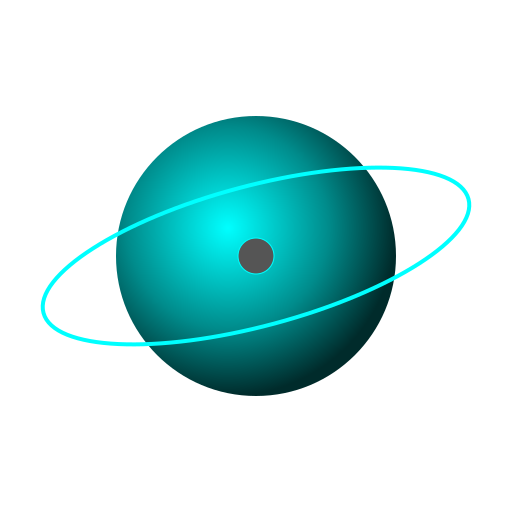

<!-- HEADER -->

  

<!-- TYPING -->

  

<!-- SPACE GIF -->

  

<!-- CONTRIBUTIONS -->
<h3 align="center">🌌 Contribution Orbit</h3>

  

<!-- STATUS -->
<h3 align="center">🛰️ Current Mission</h3>

  
  
  

  
  
  

<!-- STACK -->
<h3 align="center">🪐 Tech Constellation</h3>

  

<!-- STATS -->

<h3 align="center">📊 Galactic Stats</h3>

  

  

  

<!-- CONTACT -->

<h3 align="center">📡 Establish Link</h3>

  
  

<!-- FOOTER -->

  

